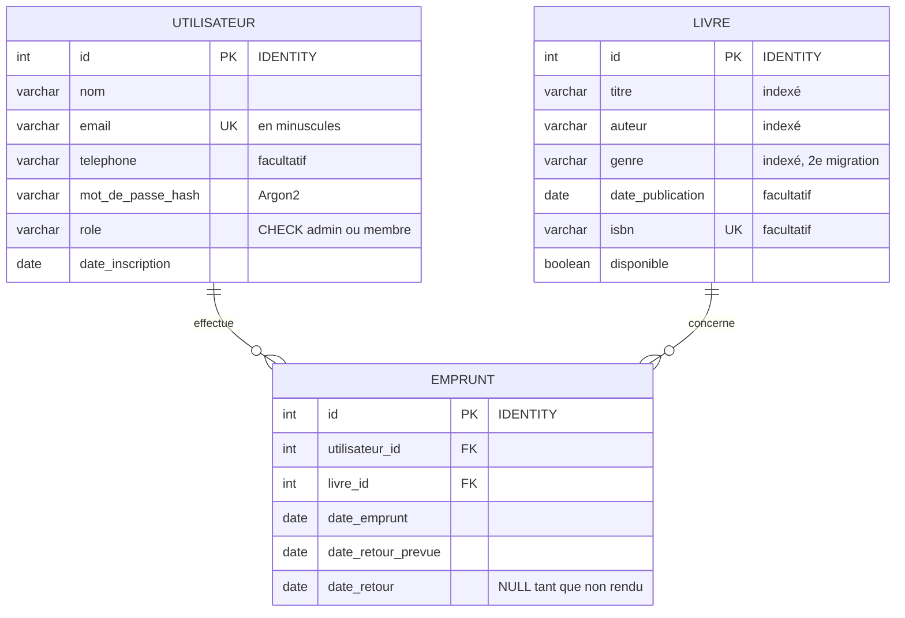

# API de gestion de bibliothèque en ligne

Mini-projet 5BDDD : API permettant aux utilisateurs d'emprunter et de rendre des livres, avec gestion de l'inventaire et des utilisateurs inscrits.

**Stack :** Oracle Database (Docker) · Python 3.13 · FastAPI · SQLAlchemy · Alembic · Pydantic

## Prérequis

- [Docker Desktop](https://www.docker.com/products/docker-desktop/) (lancé)
- [uv](https://docs.astral.sh/uv/) (gestionnaire de projet Python)

## Installation

### 1. Configuration

Copier le fichier d'exemple puis modifier les valeurs :

```powershell
Copy-Item .env.example .env
```

| Variable | Rôle |
|---|---|
| `ORACLE_PASSWORD` | Mot de passe des comptes admin Oracle (`SYS`, `SYSTEM`). Utilisé uniquement par Docker. |
| `APP_USER` / `APP_USER_PASSWORD` | Propriétaire du schéma (`BIBLIO`). Crée les tables, utilisé uniquement par Alembic. |
| `API_USER` / `API_USER_PASSWORD` | Utilisateur de l'API (`BIBLIO_API`). Peut seulement lire et écrire des données. |
| `DB_HOST` / `DB_PORT` / `DB_SERVICE` | Connexion de l'API à Oracle (`127.0.0.1`, `1521`, `FREEPDB1`). |
| `SECRET_KEY` | Clé de signature des jetons JWT. Générer avec `python -c "import secrets; print(secrets.token_hex(32))"` |
| `ACCESS_TOKEN_EXPIRE_MINUTES` | Durée de validité d'un jeton. |

Éviter les caractères `@ : /` dans les mots de passe.

### 2. Base de données Oracle

```powershell
docker compose up -d
docker compose ps        # attendre le statut "healthy" (1 à 2 min au premier lancement)
```

À la première initialisation, le script [docker/oracle/initdb/01-securite.sh](docker/oracle/initdb/01-securite.sh) crée les utilisateurs, le rôle, le profil de mots de passe et les règles d'audit (voir [Sécurité de la base](#sécurité-de-la-base)).

Les mots de passe et ce script ne s'appliquent qu'à la première initialisation. Pour repartir de zéro (**supprime toutes les données**) :

```powershell
docker compose down -v
docker compose up -d
```

### 3. Dépendances Python

```powershell
uv sync
```

## Migrations (Alembic)

Les migrations s'exécutent avec le propriétaire du schéma (`BIBLIO`). Après chaque migration, [alembic/env.py](alembic/env.py) donne automatiquement à `BIBLIO_API_ROLE` les droits `SELECT`, `INSERT`, `UPDATE`, `DELETE` sur toutes les tables.

```powershell
uv run alembic upgrade head                                   # appliquer les migrations
uv run alembic revision --autogenerate -m "description"       # créer une migration après modification des modèles
uv run alembic downgrade -1                                   # annuler la dernière migration
uv run alembic current                                        # version actuelle de la base
```

Tout nouveau modèle doit être importé dans [src/models/\_\_init\_\_.py](src/models/__init__.py), sinon `--autogenerate` ne le voit pas. Toujours relire le fichier généré avant de l'appliquer.

| Migration | Contenu |
|---|---|
| `init` | Tables `utilisateur`, `livre`, `emprunt`, contraintes et index |
| `ajout genre livre` | Colonne `livre.genre` (indexée) : évolution du schéma |

## Données de démonstration

```powershell
uv run python src/seed.py          # 3 comptes, 12 livres, 3 emprunts (refusé si la base contient déjà des livres)
uv run python src/creer_admin.py   # créer un administrateur, ou promouvoir un compte existant
```

| Compte | Mot de passe | Rôle | Emprunts |
|---|---|---|---|
| `admin@demo.fr` | `demo1234` | admin | — |
| `saer@demo.fr` | `demo1234` | membre | *Dune* en cours, *Les Misérables* rendu |
| `ibrahim@demo.fr` | `demo1234` | membre | *1984* en retard |

## Lancer l'API

**En développement** (rechargement automatique à chaque modification) :

```powershell
uv run fastapi dev src/main.py
```

**Dans Docker** (comme en production) :

```powershell
docker compose --profile api up -d --build
```

Le service `migrate` applique d'abord les migrations puis s'arrête ; l'API ne démarre que s'il a réussi (`docker compose logs migrate` en cas de problème).

Dans les deux cas, l'API est sur **http://127.0.0.1:8000** et la documentation Swagger sur **http://127.0.0.1:8000/docs**. Ne pas lancer les deux en même temps : ils utilisent le même port.

Le service `api` est dans un profil Compose : un simple `docker compose up -d` ne lance que la base et CloudBeaver.

## Routes de l'API

Dans Swagger, cliquer sur **Authorize** et se connecter avec un email et un mot de passe : le jeton JWT est ensuite envoyé automatiquement.

| Méthode | Route | Accès | Rôle |
|---|---|---|---|
| `POST` | `/users/register` | public | Inscription (toujours en tant que membre) |
| `POST` | `/auth/token` | public | Connexion, renvoie un jeton JWT (bloquée 1 min après 5 échecs depuis la même IP : `429`) |
| `GET` | `/users/me` | connecté | Profil |
| `GET` | `/users/me/loans` | connecté | Emprunts en cours |
| `GET` | `/users/me/history` | connecté | Historique des emprunts |
| `GET` | `/books?title=&author=&genre=&available=&skip=&limit=` | public | Recherche (insensible à la casse) et pagination |
| `GET` | `/books/{id}` | public | Détail d'un livre |
| `POST` | `/books` | admin | Ajout |
| `PATCH` | `/books/{id}` | admin | Modification partielle |
| `DELETE` | `/books/{id}` | admin | Suppression (refusée si le livre a un historique d'emprunts) |
| `POST` | `/loans` | connecté | Emprunt d'un livre disponible (14 jours, 5 emprunts en cours maximum) |
| `POST` | `/loans/{id}/return` | emprunteur ou admin | Retour |
| `GET` | `/loans/overdue` | admin | Emprunts en retard |
| `GET` | `/health` | public | État de l'API et de la base |

Codes d'erreur : `401` non connecté ou jeton invalide, `403` droits insuffisants, `404` introuvable, `409` conflit (livre déjà emprunté, email ou ISBN déjà utilisé…), `422` données invalides.

## Tests

```powershell
uv run pytest                                          # tous les tests
uv run pytest tests/test_emprunts.py                   # un fichier
uv run pytest tests/test_emprunts.py::test_retour      # un test
```

Les tests utilisent la vraie base Oracle (qui doit être lancée) avec le compte de l'API. Chaque test s'exécute dans une transaction annulée à la fin (`get_db` remplacé via `app.dependency_overrides`) : la base n'est jamais modifiée.

[tests/test_securite.py](tests/test_securite.py) couvre la force brute (blocage après 5 échecs), l'injection SQL (recherche, connexion, données stockées), les jetons falsifiés (`alg: none`, contenu modifié, utilisateur inexistant), le stockage des mots de passe (Argon2, sel unique) et les droits du compte Oracle de l'API (`CREATE`, `DROP`, `ALTER`, `TRUNCATE`, `GRANT` refusés).

Vérifié en plus : verrouillage Oracle après 5 échecs (`ORA-28000`), enregistrement dans le journal d'audit, et aucune vulnérabilité connue dans les dépendances (`pip-audit`).

## Performances

```powershell
uv run fastapi run src/main.py --workers 4         # terminal 1 : API en mode production
uv run python scripts/charge.py --concurrence 20   # terminal 2 : 10 s par scénario
```

Le script crée ses propres utilisateurs et livres, puis les supprime. Résultats sur un MacBook Air M1 (API, Oracle et client de test sur la même machine), 20 clients simultanés, 4 workers, aucune erreur :

| Scénario | Requêtes/s | Requêtes/min | Médiane | p95 |
|---|---:|---:|---:|---:|
| `GET /books/{id}` | 1 235 | 74 000 | 16 ms | 20 ms |
| `GET /users/me` (JWT + base) | 1 171 | 70 000 | 16 ms | 21 ms |
| `GET /books` (recherche) | 1 003 | 60 000 | 19 ms | 25 ms |
| `POST /loans` + `/return` (transaction) | 487 | 29 000 | 39 ms | 53 ms |
| `POST /auth/token` (Argon2) | 29 | 1 760 | 612 ms | 1 078 ms |

La connexion est volontairement lente : Argon2 est conçu pour coûter du temps de calcul et de la mémoire, ce qui rend la force brute impraticable. Les autres routes ne vérifient que la signature du jeton JWT, ce qui est quasi instantané.

## Schéma de la base



Règles garanties par Oracle, même si l'API avait un bug :

- `uq_emprunt_livre_en_cours` : index unique sur `CASE WHEN date_retour IS NULL THEN livre_id END`. Oracle n'indexe pas les valeurs NULL, donc seuls les emprunts en cours sont concernés : **un livre ne peut avoir qu'un seul emprunt en cours**.
- `ck_emprunt_dates_coherentes` : la date de retour ne peut pas précéder la date d'emprunt.
- `ck_utilisateur_role`, `uq_utilisateur_email`, `uq_livre_isbn`, et les clés étrangères (un livre emprunté ne peut pas être supprimé).

## Interface d'administration (CloudBeaver)

Une interface web pour explorer la base est disponible sur **http://127.0.0.1:8978**.

Au premier lancement, créer un compte admin CloudBeaver, puis une connexion **Oracle** :

| Champ | Valeur |
|---|---|
| Host | `oracle` (nom du service Docker, pas `localhost`) |
| Port | `1521` |
| Database | `FREEPDB1` (type **Service**) |
| User / Password | `APP_USER` / `APP_USER_PASSWORD` du `.env` (pour voir et gérer les tables) |

Pour consulter le journal d'audit, créer une seconde connexion avec `SYSTEM` / `ORACLE_PASSWORD`.

## Sécurité de la base

Principe du **moindre privilège** : chaque compte n'a que les droits dont il a besoin.

| Compte | Utilisé par | Droits |
|---|---|---|
| `SYS` / `SYSTEM` | Administration uniquement | Tous. Mot de passe inconnu de l'API. |
| `BIBLIO` | Alembic (migrations) | Connexion, création de tables, séquences et vues. Quota de 100 Mo. |
| `BIBLIO_API` | L'API FastAPI | Connexion et rôle `BIBLIO_API_ROLE` : `SELECT`, `INSERT`, `UPDATE`, `DELETE` sur les tables de `BIBLIO`. Aucun `CREATE`, `DROP` ou `ALTER`. |

- **Profil `BIBLIO_PROFILE`** (appliqué aux deux comptes) : compte verrouillé 15 minutes après 5 échecs de connexion, impossible de réutiliser les 5 derniers mots de passe. Pas d'expiration, pour ne pas bloquer l'API en production.
- **Audit unifié** : les échecs de connexion de tous les comptes, et les modifications de schéma (`CREATE`, `ALTER`, `DROP`, `TRUNCATE`, `GRANT`, `REVOKE`) de `BIBLIO` et `BIBLIO_API`, sont journalisés. Consultation, connecté en `SYSTEM` :

  ```sql
  SELECT event_timestamp, dbusername, action_name, return_code
  FROM unified_audit_trail
  WHERE unified_audit_policies LIKE '%BIBLIO%'
  ORDER BY event_timestamp DESC;
  ```

## Structure du projet

```
.
├── docker-compose.yml          # Oracle + CloudBeaver + migrate + API (profil "api")
├── Dockerfile                  # image de l'API (et des migrations)
├── docker/oracle/initdb/
│   └── 01-securite.sh          # utilisateurs, rôle, profil, audit (1re initialisation)
├── alembic.ini
├── alembic/
│   ├── env.py                  # connexion en BIBLIO + GRANT automatiques
│   └── versions/               # fichiers de migration
├── .env.example                # modèle de configuration
├── pyproject.toml              # dépendances (uv)
└── src/
    ├── main.py                 # application FastAPI
    ├── config.py               # Settings (API) et MigrationSettings (Alembic)
    ├── database.py             # connexion SQLAlchemy de l'API, get_db()
    ├── security.py             # hash Argon2 des mots de passe, jetons JWT
    ├── limiteur.py             # limite des échecs de connexion par IP
    ├── dependances.py          # get_current_user, get_current_admin
    ├── exceptions.py           # erreurs métier (404, 403, 409)
    ├── models/                 # SQLAlchemy : Utilisateur, Livre, Emprunt
    │   └── __init__.py         # importe tous les modèles (pour Alembic)
    ├── schemas/                # Pydantic : validation des entrées, forme des réponses
    ├── routers/                # routes, un APIRouter par ressource
    ├── services/               # logique métier (emprunt, retour, mail de confirmation)
    ├── seed.py                 # données de démonstration
    └── creer_admin.py          # création d'un administrateur
tests/                          # tests pytest
scripts/charge.py               # test de charge
```

## Choix techniques

- **Deux utilisateurs Oracle séparés** : si l'API était compromise, l'attaquant pourrait lire et modifier des données, mais pas supprimer ou modifier les tables. Voir [Sécurité de la base](#sécurité-de-la-base).
- **Mot de passe du propriétaire isolé** : seul Alembic le lit (`MigrationSettings`). La config de l'API (`Settings`) ne le contient pas, et dans Docker le conteneur `api` ne le reçoit pas : seul le conteneur éphémère `migrate` l'a.
- **Ports liés à `127.0.0.1`** : Oracle et CloudBeaver ne sont pas exposés sur le réseau local.
- **Secrets hors du code** : configuration dans `.env` (non versionné), mots de passe typés `SecretStr` pour ne jamais apparaître dans les logs.
- **Volume Docker** : les données Oracle survivent aux redémarrages du conteneur.
- **Image de l'API durcie** : exécutée avec un utilisateur non-root, `.env` exclu de l'image (les secrets sont injectés au lancement), dépendances figées par `uv.lock`.
- **Mots de passe hashés avec Argon2** (recommandé par l'OWASP) : lent et coûteux en mémoire, il résiste aux attaques par force brute. La connexion répond de la même façon, et en autant de temps, que l'email existe ou non.
- **JWT plutôt que sessions** : l'API ne stocke aucune session ; chaque jeton signé contient l'id de l'utilisateur et expire après 30 minutes.
- **Emprunt dans une seule transaction** : `SELECT ... FOR UPDATE` verrouille la ligne du livre jusqu'au commit. Deux emprunts simultanés du même livre : le second attend, puis voit le livre indisponible (testé avec 8 requêtes simultanées : 1 acceptée, 7 refusées).
- **Séparation routers / services / schémas** : les routes gèrent HTTP, les services la logique métier (sans dépendre de HTTP), les schémas la validation.
- **Limite des échecs de connexion** : 5 échecs par minute et par adresse IP, puis `429` avec l'en-tête `Retry-After`. Seuls les échecs comptent : un utilisateur légitime n'est jamais bloqué.
- **Pool de connexions fixe** (`DB_POOL_SIZE`, 10 par défaut, sans connexions supplémentaires) : sous forte charge, ouvrir et fermer des connexions en rafale faisait refuser des connexions par Oracle (`ORA-12516`) ; les requêtes attendent désormais une connexion libre.
- **Aucune fuite d'information** : les erreurs de base sont journalisées côté serveur ; le client reçoit seulement `500 Erreur interne` ou `503`, jamais de requête SQL ni de code ORA.

## Dépannage

- **La page ou la connexion charge à l'infini avec `localhost`** : sous Windows, `localhost` passe d'abord par IPv6. Utiliser `127.0.0.1`.
- **`docker compose` : failed to connect to the docker API** : Docker Desktop n'est pas lancé.
- **Connexion refusée (mot de passe invalide)** : le `.env` a été modifié après la première initialisation. Voir la réinitialisation ci-dessus.
- **`ORA-28000: the account is locked`** : 5 échecs de connexion d'affilée. Attendre 15 minutes, ou déverrouiller en `SYSTEM` : `ALTER USER biblio_api ACCOUNT UNLOCK;`
- **`bad interpreter: Permission denied` dans les journaux d'Oracle** (macOS/Linux) : le script n'est pas exécutable. Lancer `chmod +x docker/oracle/initdb/01-securite.sh`, puis réinitialiser la base.
- **Le script d'initialisation échoue avec `$'\r': command not found`** : le fichier `.sh` a des fins de ligne Windows. Le `.gitattributes` force LF ; sinon, le convertir en LF dans VS Code (en bas à droite, `CRLF` → `LF`).
