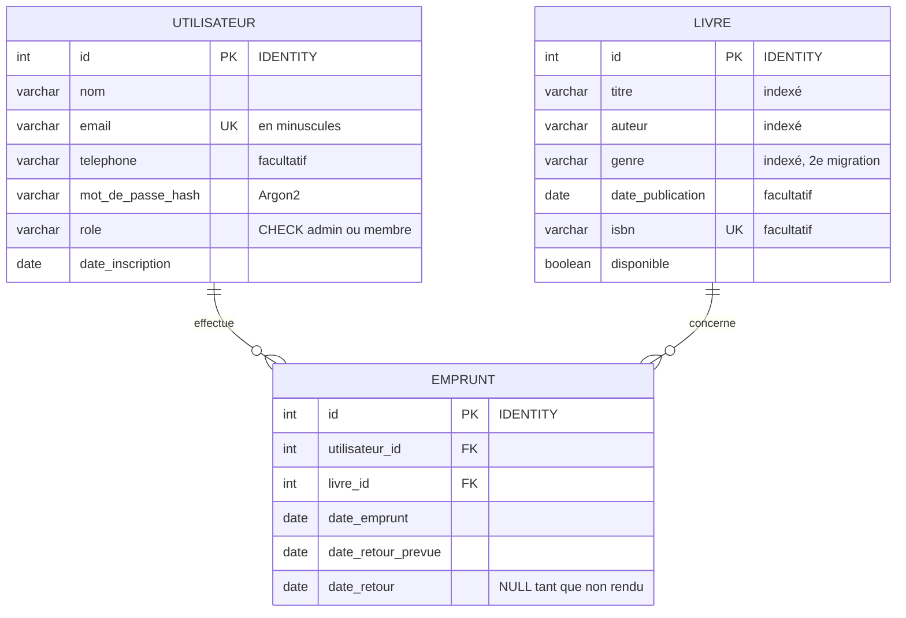

# API de gestion de bibliothèque en ligne

Mini-projet 5BDDD : API permettant aux utilisateurs d'emprunter et de rendre des livres, avec gestion de l'inventaire et des utilisateurs inscrits.

**Stack :** Oracle Database (Docker) · Python 3.13 · FastAPI · SQLAlchemy · Alembic · Pydantic

## Prérequis

- [Docker Desktop](https://www.docker.com/products/docker-desktop/) (lancé)
- [uv](https://docs.astral.sh/uv/) (gestionnaire de projet Python)

## Installation

### 1. Configuration

Copier le fichier d'exemple puis modifier les valeurs :

```powershell
Copy-Item .env.example .env
```

| Variable | Rôle |
|---|---|
| `ORACLE_PASSWORD` | Mot de passe des comptes admin Oracle (`SYS`, `SYSTEM`). Utilisé uniquement par Docker. |
| `APP_USER` / `APP_USER_PASSWORD` | Propriétaire du schéma (`BIBLIO`). Crée les tables, utilisé uniquement par Alembic. |
| `API_USER` / `API_USER_PASSWORD` | Utilisateur de l'API (`BIBLIO_API`). Peut seulement lire et écrire des données. |
| `DB_HOST` / `DB_PORT` / `DB_SERVICE` | Connexion de l'API à Oracle (`127.0.0.1`, `1521`, `FREEPDB1`). |
| `SECRET_KEY` | Clé de signature des jetons JWT. Générer avec `python -c "import secrets; print(secrets.token_hex(32))"` |
| `ACCESS_TOKEN_EXPIRE_MINUTES` | Durée de validité d'un jeton. |

Éviter les caractères `@ : /` dans les mots de passe.

### 2. Base de données Oracle

```powershell
docker compose up -d
docker compose ps        # attendre le statut "healthy" (1 à 2 min au premier lancement)
```

À la première initialisation, le script [docker/oracle/initdb/01-securite.sh](docker/oracle/initdb/01-securite.sh) crée les utilisateurs, le rôle, le profil de mots de passe et les règles d'audit (voir [Sécurité de la base](#sécurité-de-la-base)).

Les mots de passe et ce script ne s'appliquent qu'à la première initialisation. Pour repartir de zéro (**supprime toutes les données**) :

```powershell
docker compose down -v
docker compose up -d
```

### 3. Dépendances Python

```powershell
uv sync
```

## Migrations (Alembic)

Les migrations s'exécutent avec le propriétaire du schéma (`BIBLIO`). Après chaque migration, [alembic/env.py](alembic/env.py) donne automatiquement à `BIBLIO_API_ROLE` les droits `SELECT`, `INSERT`, `UPDATE`, `DELETE` sur toutes les tables.

```powershell
uv run alembic upgrade head                                   # appliquer les migrations
uv run alembic revision --autogenerate -m "description"       # créer une migration après modification des modèles
uv run alembic downgrade -1                                   # annuler la dernière migration
uv run alembic current                                        # version actuelle de la base
```

Tout nouveau modèle doit être importé dans [src/models/\_\_init\_\_.py](src/models/__init__.py), sinon `--autogenerate` ne le voit pas. Toujours relire le fichier généré avant de l'appliquer.

| Migration | Contenu |
|---|---|
| `init` | Tables `utilisateur`, `livre`, `emprunt`, contraintes et index |
| `ajout genre livre` | Colonne `livre.genre` (indexée) : évolution du schéma |

## Données de démonstration

```powershell
uv run python src/seed.py          # 3 comptes, 12 livres, 3 emprunts (refusé si la base contient déjà des livres)
uv run python src/creer_admin.py   # créer un administrateur, ou promouvoir un compte existant
```

| Compte | Mot de passe | Rôle | Emprunts |
|---|---|---|---|
| `admin@demo.fr` | `demo1234` | admin | — |
| `saer@demo.fr` | `demo1234` | membre | *Dune* en cours, *Les Misérables* rendu |
| `ibrahim@demo.fr` | `demo1234` | membre | *1984* en retard |

## Lancer l'API

**En développement** (rechargement automatique à chaque modification) :

```powershell
uv run fastapi dev src/main.py
```

**Dans Docker** (comme en production) :

```powershell
docker compose --profile api up -d --build
```

Le service `migrate` applique d'abord les migrations puis s'arrête ; l'API ne démarre que s'il a réussi (`docker compose logs migrate` en cas de problème).

Dans les deux cas, l'API est sur **http://127.0.0.1:8000** et la documentation Swagger sur **http://127.0.0.1:8000/docs**. Ne pas lancer les deux en même temps : ils utilisent le même port.

Le service `api` est dans un profil Compose : un simple `docker compose up -d` ne lance que la base et CloudBeaver.

## Routes de l'API

Dans Swagger, cliquer sur **Authorize** et se connecter avec un email et un mot de passe : le jeton JWT est ensuite envoyé automatiquement.

### Organisation des routes

- **Versionnement** : toutes les routes de l'API sont préfixées par **`/v1`** (`APIRouter(prefix="/v1")` dans [src/main.py](src/main.py), préfixe défini dans `PREFIXE_API`). Une future version incompatible serait servie sous `/v2` **en parallèle**, sans casser les clients existants. `/health` et `/docs` restent à la racine : ils ne font pas partie du contrat de l'API.
- **Routeur `/v1/admin`** ([src/routers/admin.py](src/routers/admin.py)) : toutes les routes de gestion y sont regroupées et protégées **au niveau du routeur**, sans aucun paramètre de sécurité dans les fonctions :

  ```
  /v1/admin            APIRouter(dependencies=[Depends(exiger_role_admin)])          → rôle administrateur
  ├── /books           APIRouter(dependencies=[permission("livres:ecrire")])         → + permission du jeton
  └── /loans           APIRouter(dependencies=[permission("emprunts:gerer")])        → + permission du jeton
  ```

  Une route ajoutée plus tard dans ces routeurs est protégée automatiquement : impossible d'oublier la vérification. Un test parcourt toutes les routes `/v1/admin` et vérifie qu'un membre est refusé sur chacune.

### Permissions (scopes OAuth2)

Chaque route protégée exige une **permission** (scope), inscrite dans le jeton JWT à la connexion :

| Permission | Autorise | Membre | Admin |
|---|---|:---:|:---:|
| `profil` | Lire son profil, ses emprunts en cours et son historique | ✅ | ✅ |
| `emprunts` | Emprunter et rendre ses livres | ✅ | ✅ |
| `livres:ecrire` | Ajouter, modifier, supprimer des livres | ❌ | ✅ |
| `emprunts:gerer` | Voir les retards, enregistrer le retour de n'importe quel emprunt | ❌ | ✅ |

- Sans rien demander, le jeton reçoit toutes les permissions du rôle. On peut en demander moins (champ `scope` du formulaire de connexion, ou cases à cocher dans **Authorize**), par exemple un jeton en lecture seule avec `scope=profil`.
- Une permission que le rôle n'a pas est ignorée ; une permission inconnue est refusée (`400`). La réponse indique les permissions accordées.
- À chaque requête, les permissions du jeton sont **recoupées avec le rôle actuel** : un administrateur rétrogradé perd ses droits immédiatement, sans attendre l'expiration de son jeton.
- Permission manquante : `403 Permission insuffisante : livres:ecrire requis`, avec l'en-tête standard `WWW-Authenticate: Bearer error="insufficient_scope"`.

| Méthode | Route | Permission | Rôle |
|---|---|---|---|
| `POST` | `/v1/users/register` | public | Inscription (toujours en tant que membre) |
| `POST` | `/v1/auth/token` | public | Connexion, renvoie un jeton JWT et ses permissions (bloquée 1 min après 5 échecs depuis la même IP : `429`) |
| `GET` | `/v1/users/me` | `profil` | Profil |
| `GET` | `/v1/users/me/loans` | `profil` | Emprunts en cours |
| `GET` | `/v1/users/me/history` | `profil` | Historique des emprunts |
| `GET` | `/v1/books?title=&author=&genre=&available=&skip=&limit=` | public | Recherche (insensible à la casse) et pagination (`X-Total-Count`, `Link`) ; paramètre inconnu refusé (`422`) |
| `GET` | `/v1/books/{id}` | public | Détail d'un livre, avec `ETag` (`304` si `If-None-Match` correspond) |
| `GET` | `/v1/books/{id}/cover` | public | Image de couverture (JPEG, PNG ou WebP), avec `ETag` / `304` |
| `POST` | `/v1/admin/books` | `livres:ecrire` | Ajout |
| `PATCH` | `/v1/admin/books/{id}` | `livres:ecrire` | Modification partielle (`412` si `If-Match` ne correspond plus) |
| `DELETE` | `/v1/admin/books/{id}` | `livres:ecrire` | Suppression (refusée si le livre a un historique d'emprunts) |
| `PUT` | `/v1/admin/books/{id}/cover` | `livres:ecrire` | Ajout ou remplacement de la couverture (fichier, 500 Ko max) |
| `DELETE` | `/v1/admin/books/{id}/cover` | `livres:ecrire` | Suppression de la couverture |
| `POST` | `/v1/loans` | `emprunts` | Emprunt d'un livre disponible (14 jours, 5 emprunts en cours maximum) |
| `POST` | `/v1/loans/{id}/return` | `emprunts` (+ `emprunts:gerer` pour l'emprunt d'un autre) | Retour |
| `GET` | `/v1/admin/loans/overdue` | `emprunts:gerer` | Emprunts en retard |
| `GET` | `/v1/admin/loans/export` | `emprunts:gerer` | Export CSV de tous les emprunts (en cours, en retard, rendus), envoyé en flux |
| `GET` | `/health` | public | État de l'API et de la base |

### Suivi des requêtes

Chaque réponse contient deux en-têtes ajoutés par un middleware ([src/suivi_requetes.py](src/suivi_requetes.py)) :

- **`X-Request-ID`** : identifiant unique de la requête, repris dans les journaux du serveur en cas d'erreur ou de lenteur (plus d'1 s). Un client peut fournir le sien (lettres, chiffres, `.`, `_`, `-`, 64 caractères maximum), sinon il est généré.
- **`X-Process-Time`** : durée de traitement côté serveur, en secondes.

Ces en-têtes, ainsi que `Location`, `Retry-After`, `ETag`, `X-Total-Count`, `Link` et `Content-Disposition`, sont lisibles par le JavaScript des sites autorisés par CORS (`expose_headers`).

### Couvertures de livres

- **Envoi** : `PUT /v1/admin/books/{id}/cover`, formulaire `multipart/form-data` avec un champ `fichier` (dans Swagger : bouton *Choose File*). Remplace la couverture existante.
- **Lecture** : chaque livre renvoyé par l'API contient `couverture_url` (`/v1/books/{id}/cover`, ou `null` sans couverture).
- **Stockage** : table `couverture` séparée (BLOB Oracle), pour que les recherches de livres ne chargent jamais les images. `ON DELETE CASCADE` : supprimer un livre supprime sa couverture.
- **Sécurité** :
  - le format est déterminé d'après les **premiers octets du fichier** (signature), jamais d'après son nom ou le type annoncé par le client : un fichier texte renommé en `.jpg` est refusé (`415`) ;
  - seuls **JPEG, PNG et WebP** sont acceptés : pas de SVG, qui peut contenir du JavaScript ;
  - **500 Ko** maximum (`413`), fichier vide refusé (`400`) ;
  - l'image est renvoyée avec `X-Content-Type-Options: nosniff` : le navigateur ne peut pas l'interpréter comme autre chose qu'une image.

```powershell
curl.exe -X PUT http://127.0.0.1:8000/v1/admin/books/1/cover -H "Authorization: Bearer <jeton>" -F "fichier=@dune.jpg"
```

### Pagination, cache et concurrence

- **Pagination** : `GET /v1/books` renvoie `X-Total-Count` (nombre total de résultats) et `Link` avec les URL des pages `first`, `prev`, `next`, `last`, filtres conservés (comme l'API GitHub).
- **Cache (ETag / 304)** : `GET /v1/books/{id}` renvoie un `ETag` (empreinte du contenu). Un client qui le renvoie dans `If-None-Match` reçoit `304 Not Modified`, sans contenu, si le livre n'a pas changé.
- **Concurrence optimiste (If-Match / 412)** : en envoyant dans `If-Match` l'ETag lu avant de modifier, un administrateur reçoit `412 Precondition Failed` si un autre a modifié le livre entre-temps, au lieu d'écraser son travail. La ligne est verrouillée (`SELECT ... FOR UPDATE`) entre la vérification et l'écriture.

```powershell
# Exemple : modifier un livre sans écraser une modification concurrente
curl.exe -i http://127.0.0.1:8000/v1/books/1                                   # noter l'ETag
curl.exe -i -X PATCH http://127.0.0.1:8000/v1/admin/books/1 -H "Authorization: Bearer <jeton>" `
  -H 'If-Match: "<etag>"' -H "Content-Type: application/json" -d '{\"genre\": \"Roman\"}'
```

Codes d'erreur : `401` non connecté ou jeton invalide, `403` permission insuffisante, `404` introuvable, `409` conflit (livre déjà emprunté, email ou ISBN déjà utilisé…), `422` données invalides.

## Tests

```powershell
uv run pytest                                          # tous les tests
uv run pytest tests/test_emprunts.py                   # un fichier
uv run pytest tests/test_emprunts.py::test_retour      # un test
```

Les tests utilisent la vraie base Oracle (qui doit être lancée) avec le compte de l'API. Chaque test s'exécute dans une transaction annulée à la fin (`get_db` remplacé via `app.dependency_overrides`) : la base n'est jamais modifiée.

[tests/test_securite.py](tests/test_securite.py) couvre la force brute (blocage après 5 échecs), l'injection SQL (recherche, connexion, données stockées), les jetons falsifiés (`alg: none`, contenu modifié, utilisateur inexistant), le stockage des mots de passe (Argon2, sel unique) et les droits du compte Oracle de l'API (`CREATE`, `DROP`, `ALTER`, `TRUNCATE`, `GRANT` refusés).

Vérifié en plus : verrouillage Oracle après 5 échecs (`ORA-28000`), enregistrement dans le journal d'audit, et aucune vulnérabilité connue dans les dépendances (`pip-audit`).

## Performances

```powershell
uv run fastapi run src/main.py --workers 4         # terminal 1 : API en mode production
uv run python scripts/charge.py --concurrence 20   # terminal 2 : 10 s par scénario
```

Le script crée ses propres utilisateurs et livres, puis les supprime. Résultats sur un MacBook Air M1 (API, Oracle et client de test sur la même machine), 20 clients simultanés, 4 workers, aucune erreur :

| Scénario | Requêtes/s | Requêtes/min | Médiane | p95 |
|---|---:|---:|---:|---:|
| `GET /v1/books/{id}` | 1 235 | 74 000 | 16 ms | 20 ms |
| `GET /v1/users/me` (JWT + base) | 1 171 | 70 000 | 16 ms | 21 ms |
| `GET /v1/books` (recherche) | 1 003 | 60 000 | 19 ms | 25 ms |
| `POST /v1/loans` + `/return` (transaction) | 487 | 29 000 | 39 ms | 53 ms |
| `POST /v1/auth/token` (Argon2) | 29 | 1 760 | 612 ms | 1 078 ms |

La connexion est volontairement lente : Argon2 est conçu pour coûter du temps de calcul et de la mémoire, ce qui rend la force brute impraticable. Les autres routes ne vérifient que la signature du jeton JWT, ce qui est quasi instantané.

## Schéma de la base



Règles garanties par Oracle, même si l'API avait un bug :

- `uq_emprunt_livre_en_cours` : index unique sur `CASE WHEN date_retour IS NULL THEN livre_id END`. Oracle n'indexe pas les valeurs NULL, donc seuls les emprunts en cours sont concernés : **un livre ne peut avoir qu'un seul emprunt en cours**.
- `ck_emprunt_dates_coherentes` : la date de retour ne peut pas précéder la date d'emprunt.
- `ck_utilisateur_role`, `uq_utilisateur_email`, `uq_livre_isbn`, et les clés étrangères (un livre emprunté ne peut pas être supprimé).

## Interface d'administration (CloudBeaver)

Une interface web pour explorer la base est disponible sur **http://127.0.0.1:8978**.

Au premier lancement, créer un compte admin CloudBeaver, puis une connexion **Oracle** :

| Champ | Valeur |
|---|---|
| Host | `oracle` (nom du service Docker, pas `localhost`) |
| Port | `1521` |
| Database | `FREEPDB1` (type **Service**) |
| User / Password | `APP_USER` / `APP_USER_PASSWORD` du `.env` (pour voir et gérer les tables) |

Pour consulter le journal d'audit, créer une seconde connexion avec `SYSTEM` / `ORACLE_PASSWORD`.

## Sécurité de la base

Principe du **moindre privilège** : chaque compte n'a que les droits dont il a besoin.

| Compte | Utilisé par | Droits |
|---|---|---|
| `SYS` / `SYSTEM` | Administration uniquement | Tous. Mot de passe inconnu de l'API. |
| `BIBLIO` | Alembic (migrations) | Connexion, création de tables, séquences et vues. Quota de 100 Mo. |
| `BIBLIO_API` | L'API FastAPI | Connexion et rôle `BIBLIO_API_ROLE` : `SELECT`, `INSERT`, `UPDATE`, `DELETE` sur les tables de `BIBLIO`. Aucun `CREATE`, `DROP` ou `ALTER`. |

- **Profil `BIBLIO_PROFILE`** (appliqué aux deux comptes) : compte verrouillé 15 minutes après 5 échecs de connexion, impossible de réutiliser les 5 derniers mots de passe. Pas d'expiration, pour ne pas bloquer l'API en production.
- **Audit unifié** : les échecs de connexion de tous les comptes, et les modifications de schéma (`CREATE`, `ALTER`, `DROP`, `TRUNCATE`, `GRANT`, `REVOKE`) de `BIBLIO` et `BIBLIO_API`, sont journalisés. Consultation, connecté en `SYSTEM` :

  ```sql
  SELECT event_timestamp, dbusername, action_name, return_code
  FROM unified_audit_trail
  WHERE unified_audit_policies LIKE '%BIBLIO%'
  ORDER BY event_timestamp DESC;
  ```

## Codes de réponse HTTP

Toutes les erreurs ont le même format JSON, `{"detail": "message en français"}`, sauf la 422 qui détaille chaque champ. Chaque route déclare dans Swagger (`/docs`) les codes qu'elle peut renvoyer, avec des exemples. Dans Swagger, les codes sont colorés par famille : **2xx en vert**, **4xx en orange**, **5xx en rouge**, y compris dans les réponses obtenues avec « Try it out ».

| Code | Signification | Exemples |
|---|---|---|
| `200` OK | Succès | Lecture, modification, retour d'un livre |
| `201` Created | Ressource créée | `POST /v1/admin/books` (en-tête `Location: /v1/books/42`), `POST /v1/users/register` (`Location: /v1/users/me`), `POST /v1/loans` |
| `204` No Content | Succès, sans contenu | `DELETE /v1/admin/books/{id}` |
| `304` Not Modified | Contenu inchangé depuis l'ETag envoyé | `GET /v1/books/{id}` avec `If-None-Match` |
| `400` Bad Request | Requête incohérente | `PATCH /v1/admin/books/{id}` sans aucun champ |
| `401` Unauthorized | Pas authentifié | Jeton absent, invalide ou expiré ; mauvais mot de passe |
| `403` Forbidden | Authentifié mais pas autorisé | Route admin appelée par un membre ; retour de l'emprunt d'un autre |
| `404` Not Found | Introuvable | Livre ou emprunt inexistant ; URL inexistante |
| `405` Method Not Allowed | Méthode HTTP non prévue sur cette route | `PUT /v1/books` (méthodes autorisées dans l'en-tête `Allow`) |
| `409` Conflict | Contraire à l'état actuel des données | Email ou ISBN déjà utilisé, livre déjà emprunté, limite de 5 emprunts, livre déjà rendu |
| `412` Precondition Failed | La ressource a changé depuis l'ETag envoyé dans `If-Match` | `PATCH /v1/admin/books/{id}` après une modification concurrente |
| `413` Content Too Large | Corps de requête trop gros (1 Mo par défaut, `TAILLE_MAX_REQUETE`), ou couverture de plus de 500 Ko | Envoi de données énormes |
| `415` Unsupported Media Type | Fichier envoyé dans un format refusé | Couverture qui n'est pas une image JPEG, PNG ou WebP |
| `422` Unprocessable Content | Données invalides | Email mal formé, champ obligatoire manquant, `limit=500` |
| `429` Too Many Requests | Trop d'échecs de connexion | 6e échec en une minute depuis la même IP (délai dans `Retry-After`) |
| `500` Internal Server Error | Erreur inattendue | Détail journalisé côté serveur, jamais envoyé au client |
| `503` Service Unavailable | Base de données injoignable | Oracle arrêté ou saturé |

Exemple de réponse 422 :

```json
{
  "detail": "Données invalides",
  "erreurs": [
    {"emplacement": "body", "champ": "email", "message": "Adresse email invalide"},
    {"emplacement": "body", "champ": "mot_de_passe", "message": "Au moins 8 caractère(s)"}
  ]
}
```

## Structure du projet

```
.
├── docker-compose.yml          # Oracle + CloudBeaver + migrate + API (profil "api")
├── Dockerfile                  # image de l'API (et des migrations)
├── docker/oracle/initdb/
│   └── 01-securite.sh          # utilisateurs, rôle, profil, audit (1re initialisation)
├── alembic.ini
├── alembic/
│   ├── env.py                  # connexion en BIBLIO + GRANT automatiques
│   └── versions/               # fichiers de migration
├── .env.example                # modèle de configuration
├── pyproject.toml              # dépendances (uv)
└── src/
    ├── main.py                 # application FastAPI
    ├── config.py               # Settings (API) et MigrationSettings (Alembic)
    ├── database.py             # connexion SQLAlchemy de l'API, get_db()
    ├── security.py             # hash Argon2 des mots de passe, jetons JWT
    ├── limiteur.py             # limite des échecs de connexion par IP
    ├── dependances.py          # get_current_user + permissions requises (Security, SecurityScopes)
    ├── permissions.py          # liste des scopes OAuth2 et scopes de chaque rôle
    ├── suivi_requetes.py       # middleware X-Request-ID / X-Process-Time
    ├── etag.py                 # ETag, If-None-Match (304) et If-Match (412)
    ├── exceptions.py           # erreurs métier (404, 403, 409)
    ├── gestion_erreurs.py      # 401/404/405/422 en français, codes communs dans Swagger
    ├── reponses.py             # codes d'erreur documentés par route (responses=)
    ├── limite_taille.py        # middleware 413 (taille maximale des requêtes)
    ├── documentation.py        # page /docs personnalisée (codes de réponse colorés)
    ├── static/swagger.css      # couleurs : 2xx vert, 4xx orange, 5xx rouge
    ├── models/                 # SQLAlchemy : Utilisateur, Livre, Emprunt, Couverture
    │   └── __init__.py         # importe tous les modèles (pour Alembic)
    ├── schemas/                # Pydantic : validation des entrées, forme des réponses
    ├── routers/                # routes, un APIRouter par ressource
    │   └── admin.py            # routeur /admin : protection déclarée une fois pour toutes ses routes
    ├── services/               # logique métier (emprunt, retour, mail de confirmation, export CSV, couvertures)
    ├── seed.py                 # données de démonstration
    └── creer_admin.py          # création d'un administrateur
tests/                          # tests pytest
scripts/charge.py               # test de charge
```

## Choix techniques

- **Deux utilisateurs Oracle séparés** : si l'API était compromise, l'attaquant pourrait lire et modifier des données, mais pas supprimer ou modifier les tables. Voir [Sécurité de la base](#sécurité-de-la-base).
- **Mot de passe du propriétaire isolé** : seul Alembic le lit (`MigrationSettings`). La config de l'API (`Settings`) ne le contient pas, et dans Docker le conteneur `api` ne le reçoit pas : seul le conteneur éphémère `migrate` l'a.
- **Ports liés à `127.0.0.1`** : Oracle et CloudBeaver ne sont pas exposés sur le réseau local.
- **Secrets hors du code** : configuration dans `.env` (non versionné), mots de passe typés `SecretStr` pour ne jamais apparaître dans les logs.
- **Volume Docker** : les données Oracle survivent aux redémarrages du conteneur.
- **Image de l'API durcie** : exécutée avec un utilisateur non-root, `.env` exclu de l'image (les secrets sont injectés au lancement), dépendances figées par `uv.lock`.
- **Mots de passe hashés avec Argon2** (recommandé par l'OWASP) : lent et coûteux en mémoire, il résiste aux attaques par force brute. La connexion répond de la même façon, et en autant de temps, que l'email existe ou non.
- **JWT plutôt que sessions** : l'API ne stocke aucune session ; chaque jeton signé contient l'id de l'utilisateur, ses permissions et expire après 30 minutes.
- **Permissions (scopes OAuth2) plutôt qu'un simple test « admin ou non »** : chaque route déclare précisément ce dont elle a besoin (`Security(get_current_user, scopes=[...])`), on peut délivrer un jeton restreint (lecture seule), et les permissions sont recoupées avec le rôle actuel à chaque requête.
- **Paramètres de recherche dans un modèle Pydantic** (`FiltresLivres`, `extra="forbid"`) : validation regroupée et réutilisable, et une faute de frappe dans un paramètre est signalée (`422`) au lieu de renvoyer silencieusement tous les livres.
- **API versionnée (`/v1`)** : on peut faire évoluer l'API de façon incompatible (`/v2`) sans casser les clients existants, qui continuent d'utiliser `/v1` le temps de migrer.
- **Protection au niveau du routeur `/admin`** plutôt que dans chaque route : la sécurité ne dépend pas de la vigilance de celui qui ajoute une route. Deux niveaux : le rôle administrateur pour tout `/admin`, puis la permission du jeton pour chaque partie.
- **Concurrence optimiste (ETag + If-Match)** plutôt qu'un verrou long : aucun livre n'est bloqué pendant qu'un administrateur remplit son formulaire ; c'est seulement au moment d'écrire qu'on vérifie que personne ne l'a modifié entre-temps (`412` sinon).
- **Couvertures vérifiées par leur contenu** (signature des octets) plutôt que par l'extension ou le `Content-Type` envoyés par le client, qui peuvent mentir ; SVG exclu (peut contenir du JavaScript) ; images dans une table séparée pour ne jamais alourdir les recherches.
- **Export CSV en flux** (`StreamingResponse` + `yield_per`) : chaque ligne est envoyée dès qu'elle est lue en base ; la mémoire utilisée ne dépend pas du nombre d'emprunts.
- **Identifiant de requête** (`X-Request-ID`) : relie une erreur vue par un utilisateur à la ligne exacte des journaux du serveur, sans jamais exposer de détail technique au client.
- **Emprunt dans une seule transaction** : `SELECT ... FOR UPDATE` verrouille la ligne du livre jusqu'au commit. Deux emprunts simultanés du même livre : le second attend, puis voit le livre indisponible (testé avec 8 requêtes simultanées : 1 acceptée, 7 refusées).
- **Séparation routers / services / schémas** : les routes gèrent HTTP, les services la logique métier (sans dépendre de HTTP), les schémas la validation.
- **Limite des échecs de connexion** : 5 échecs par minute et par adresse IP, puis `429` avec l'en-tête `Retry-After`. Seuls les échecs comptent : un utilisateur légitime n'est jamais bloqué.
- **Pool de connexions fixe** (`DB_POOL_SIZE`, 10 par défaut, sans connexions supplémentaires) : sous forte charge, ouvrir et fermer des connexions en rafale faisait refuser des connexions par Oracle (`ORA-12516`) ; les requêtes attendent désormais une connexion libre.
- **Aucune fuite d'information** : les erreurs de base sont journalisées côté serveur ; le client reçoit seulement `500 Erreur interne` ou `503`, jamais de requête SQL ni de code ORA.
- **Taille des requêtes limitée** (`413`) : un middleware refuse tout corps de plus de 1 Mo, avant même de le lire si l'en-tête `Content-Length` l'annonce, sinon en comptant les octets pendant la lecture. Empêche de saturer la mémoire de l'API avec un envoi énorme.
- **Codes HTTP précis et documentés** : chaque erreur a son code (304, 400, 401, 403, 404, 405, 409, 412, 413, 415, 422, 429, 500, 503) et un message en français ; Swagger les liste route par route. Voir [Codes de réponse HTTP](#codes-de-réponse-http).

## Dépannage

- **La page ou la connexion charge à l'infini avec `localhost`** : sous Windows, `localhost` passe d'abord par IPv6. Utiliser `127.0.0.1`.
- **`docker compose` : failed to connect to the docker API** : Docker Desktop n'est pas lancé.
- **Connexion refusée (mot de passe invalide)** : le `.env` a été modifié après la première initialisation. Voir la réinitialisation ci-dessus.
- **`ORA-28000: the account is locked`** : 5 échecs de connexion d'affilée. Attendre 15 minutes, ou déverrouiller en `SYSTEM` : `ALTER USER biblio_api ACCOUNT UNLOCK;`
- **`bad interpreter: Permission denied` dans les journaux d'Oracle** (macOS/Linux) : le script n'est pas exécutable. Lancer `chmod +x docker/oracle/initdb/01-securite.sh`, puis réinitialiser la base.
- **Le script d'initialisation échoue avec `$'\r': command not found`** : le fichier `.sh` a des fins de ligne Windows. Le `.gitattributes` force LF ; sinon, le convertir en LF dans VS Code (en bas à droite, `CRLF` → `LF`).
